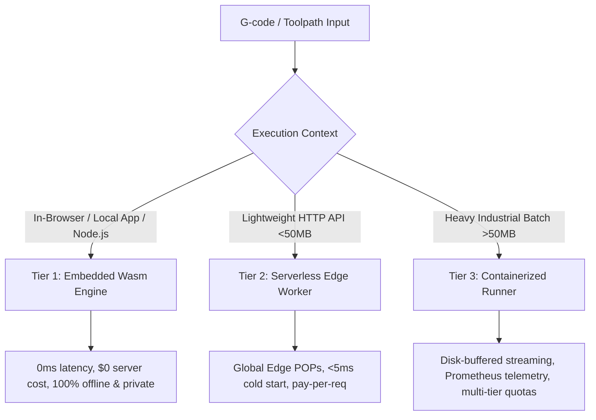

# Verification Deployment Architecture & Non-Container Alternatives

**Status:** approved, 2026-08-29 · **Precedes:** Phase 6 (Production Deployment)

## 1. Context & Motivation

Dry verification evaluates toolpaths against machine safety bounds, kinematics ceilings, retraction rules, thermal invariants, and collision geometries.

While `containers/verify-runner` provides a containerized Axum microservice with `/tmp` disk-streaming for massive multi-hundred-megabyte industrial jobs, requiring full Docker/Kubernetes container infrastructure creates unnecessary operational overhead for client applications, browser widgets, CI actions, and edge services.

This document establishes a **3-tier multi-modal verification architecture** that allows consumers to verify G-code and L1/L2 toolpaths without dragging container infrastructure.

---

## 2. The 3 Deployment Tiers

### Tier 1: Embedded In-Process WebAssembly (`@dry/sdk` & `dry-wasm`)

- **Runtime:** Browser V8/SpiderMonkey/JavaScriptCore or Node.js / Bun runtime.
- **Entry Point:** `verifyGcode(gcodeText, contracts?)` in `@dry/sdk` and `verify_gcode_to_report_wasm` in `dry-wasm`.
- **Infrastructure:** **Zero servers, zero containers, zero network round-trips.**
- **Characteristics:**
  - **Latency:** Sub-millisecond (0ms network delay).
  - **Cost:** $0.00/month.
  - **Privacy & Security:** Intellectual property (proprietary toolpaths, CAD geometry) never leaves the user's workstation.
  - **Best For:** CAD/CAM Web IDEs, slicer preview panes, local pre-flight checks, desktop plugins, GitHub Actions.

### Tier 2: Serverless Edge Workers (`dry-cloud` — Cloudflare Workers / Fastly Compute)

- **Runtime:** WebAssembly isolate in V8 edge nodes (Cloudflare Workers, Fastly Compute, AWS Lambda with Wasm).
- **Entry Point:** `POST /verify` in `crates/cloud`.
- **Infrastructure:** Managed serverless edge network.
- **Characteristics:**
  - **Cold Start:** $<5\text{ms}$ globally.
  - **Cost:** Pay-per-request ($0 base cost).
  - **Scale:** Auto-scales from 0 to 100,000+ requests/second without cluster provisioning.
  - **Payload Limit:** Best suited for files up to 50 MB.
  - **Best For:** Mobile apps, web portal verification APIs, automated webhook validation.

### Tier 3: Containerized Streaming Runner (`containers/verify-runner`)

- **Runtime:** Debian Linux container running native Axum daemon (compiled with Rust 1.88).
- **Entry Point:** `POST /verify` (streams body to `/tmp` spooling buffer).
- **Infrastructure:** Docker / Kubernetes / Fly.io / AWS ECS.
- **Characteristics:**
  - **Memory & Storage:** Up to 6 GiB+ RAM with NVMe SSD disk streaming; handles 500 MB+ multi-million segment g-code files.
  - **Observability:** Granular Prometheus `/metrics`, request latency percentiles ($p50, p95, p99$).
  - **Licensing & Auth:** Ed25519 offline token validation, CRL revocation checks, dynamic tier rate limits.
  - **Best For:** Industrial CNC factory floors, continuous manufacturing production lines, high-throughput slicing batch jobs.

---

## 3. Comparison Matrix

| Dimension | Tier 1: Embedded Wasm | Tier 2: Serverless Edge Worker | Tier 3: Containerized Runner |
|---|---|---|---|
| **Container Overhead** | **None** | **None** | Yes (Docker / K8s) |
| **Server Cost** | **$0** | **Pay-per-req (~$0.15 / 1M)** | Dedicated VM ($20–$100+/mo) |
| **Cold-Start Time** | **0 ms** | **< 5 ms** | 1–5 seconds |
| **Max G-code Size** | ~50 MB (client RAM) | ~50 MB (isolate RAM) | **500 MB+ (disk spooling)** |
| **Network Dependency** | **100% Offline** | HTTPS network call | HTTPS network call |
| **Data Confidentiality** | **Local only (100% private)** | Decrypted in edge RAM | Decrypted in server RAM |
| **Telemetry & Metrics** | Client-side metrics | Edge analytics | **Prometheus exporter** |

---

## 4. Verification Evidence & Contracts

- **Tier 1 (Wasm):** Tested in [sdk/ts/test/verify_gcode.test.ts](sdk/ts/test/verify_gcode.test.ts).
- **Tier 2 (Serverless):** Tested in [crates/cloud/src/lib.rs](crates/cloud/src/lib.rs).
- **Tier 3 (Container):** Tested in [containers/verify-runner/tests/handler.rs](containers/verify-runner/tests/handler.rs) and [containers/verify-runner/tests/load_benchmark.rs](containers/verify-runner/tests/load_benchmark.rs).
