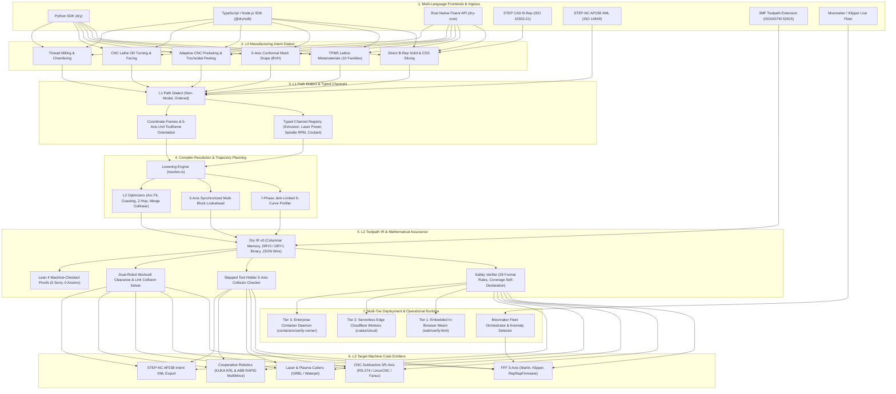

# Dry — System Capabilities & Architecture Graph

> **Normative Reference**: System architecture, compiler lowering topology, mathematical assurance, and operational guidelines for Dry (DryMachina).

---

## 1. System Topology & Architecture Graph

Dry is a high-assurance, multi-dialect parametric CAM compiler and motion-planning engine. It transforms declarative manufacturing intent into bit-exact, verified machine code across additive, subtractive, robotic, and hybrid manufacturing processes.



---

## 2. Dialect Layer Invariants & Compiler Contract

The compilation pipeline strictly enforces four formal representation levels:

| Dialect Level | Scope & Semantic Model | Invariant Guarantees | Primary Modules |
|---|---|---|---|
| **$L_0$** | High-level feature generation (solids, lattices, pockets, meshes). | Deterministic, bounded memory, coordinate-frame safe, zero NaN propagation. | `generate/` (`brep.rs`, `tpms.rs`, `drape.rs`, `pocket.rs`, `lathe.rs`) |
| **$L_1$** | Linear, arc, spline, and channel operations with explicit state. | Non-modal, last-write-wins orientation, strict unit typing. | `resolve/`, `channel.rs`, `frame.rs` |
| **$L_2$** | Resolved absolute Cartesian toolpath with physical quantities. | Bitwise determinism, verified kinematic continuity, DRY0/DRY1 binary round-trip. | `ir/`, `optimize/` (`lookahead.rs`, `scurve.rs`), `units.rs` |
| **$L_3$** | Controller-specific machine code and post-processed programs. | Formally validated G-code, KRL, RAPID, RS-274, and STEP-NC XML. | `emit/` (`gcode/`, `krl.rs`, `rapid.rs`, `step_nc.rs`) |

---

## 3. Subsystem Operational Instructions

### Instruction 1: Direct STEP CAD B-Rep Solid Slicing

To slice an exact STEP AP203/AP214/AP242 CAD model without mesh tessellation:

```python
import dry

# 1. Parse analytical B-Rep solid from STEP content
with open("bracket.stp", "r") as f:
    step_content = f.read()

solid = dry.BrepSolid.parse_step_iso10303(step_content)

# 2. Slice directly into L1 operations with exact 5-axis surface normal vectors
# slice_to_l1_ops(z_start, z_end, layer_height, samples_per_slice, feedrate)
ops = solid.slice_to_l1_ops(0.0, 50.0, 0.20, 64, 1800.0)

# 3. Resolve and emit 5-axis machine code
design = dry.Design()
design.ops.extend(ops)
gcode = design.gcode(flavor="rs274", five_axis=True, rotary_axes="bc")
```

### Instruction 2: 5-Axis Multi-Axis Synchronized Lookahead Optimization

To optimize a 5-axis toolpath with synchronized linear and rotary acceleration and jerk limits:

```rust
use dry_core::{
    optimize_five_axis_lookahead, FiveAxisLookaheadParams, Toolpath,
};

let params = FiveAxisLookaheadParams {
    max_linear_accel: 2500.0,      // mm/s^2
    max_linear_jerk: 40000.0,      // mm/s^3
    max_rotary_speed_deg_s: 180.0, // deg/s (30 RPM)
    max_rotary_accel_deg_s2: 1200.0, // deg/s^2
    max_rotary_jerk_deg_s3: 20000.0, // deg/s^3
};

// Apply multi-block backward and forward lookahead planning
let optimized_toolpath = optimize_five_axis_lookahead(&raw_toolpath, &params);
```

### Instruction 3: Moonraker Fleet Management & Real-Time Anomaly Detection

To register machines, poll telemetry, and catch thermal runaways:

```rust
use dry_moonraker::{FleetManager, FleetMember, PrinterLiveStatus};

let mut fleet = FleetManager::new();
fleet.add_member(FleetMember {
    id: "voron-01".into(),
    name: "Voron 2.4 350mm".into(),
    base_url: "http://192.168.1.120".into(),
    api_key: None,
    tags: vec!["abs".into(), "enclosed".into()],
});

let live_telemetry = PrinterLiveStatus {
    state: "printing".into(),
    nozzle_temp_c: 215.0, // Actual reading
    bed_temp_c: 105.0,
    progress: 0.42,
};

// Check against planned process targets (245°C nozzle, 105°C bed)
let anomalies = fleet.detect_anomalies(&live_telemetry, 245.0, 105.0);
for anomaly in anomalies {
    eprintln!("[{}] {}: {}", anomaly.severity, anomaly.code, anomaly.message);
}
```

### Instruction 4: Dual-Arm Cooperative Robotics Workcell Synchronization

To verify link clearances and emit synchronized KUKA KRL or ABB RAPID programs:

```rust
use dry_core::multi_robot::{
    check_dual_robot_clearance, emit_dual_robot_sync_krl, emit_dual_robot_sync_rapid,
    WorkcellRobot,
};
use dry_core::emit::{Robot6AxisModel, RobotJoints6};

let model = Robot6AxisModel::kuka_kr6_r900();
let r1 = WorkcellRobot::new("AdditiveArm", model.clone(), [0.0, 0.0, 0.0]);
let r2 = WorkcellRobot::new("MillingArm", model, [1600.0, 0.0, 0.0]);

// Verify clearance across all 6 intermediate link spheres
let clearance = check_dual_robot_clearance(&r1, &joints1, &r2, &joints2, 50.0);
if !clearance.safe {
    panic!("Collision risk! Min distance = {} mm", clearance.min_distance_mm);
}

// Emit barrier synchronization blocks
let krl_master = emit_dual_robot_sync_krl(10, true);
let krl_slave = emit_dual_robot_sync_krl(10, false);
```

---

## 4. Verification & Formal Quality Gates

Every code modification to the Dry kernel must pass the full verification matrix:

1. **Rust Core & CLI Unit/Integration Tests**: `cargo test -p dry-core -p dry-cli -p dry-moonraker`
2. **TypeScript & Node.js SDK Suite**: `(cd sdk/ts && npm test)`
3. **Python PyO3 SDK Suite**: `pytest py/tests`
4. **Machine-Checked Proof Claims**: `python3 tools/validate_proof_claims.py`
5. **Spec & Normative Clause Links**: `python3 tools/validate_spec_claim_links.py`
6. **Numeric Boundary & Floating-Point Error Budgets**: `python3 tools/validate_numeric_boundaries.py`
7. **Agent Verification & Workspace Governance**: `python3 tools/validate_agent_contracts.py`
8. **Licensing & Attribution Audit**: `python3 tools/check_license_headers.py`
9. **Public Documentation Portal Build**: `bash docs/site/build.sh public`
