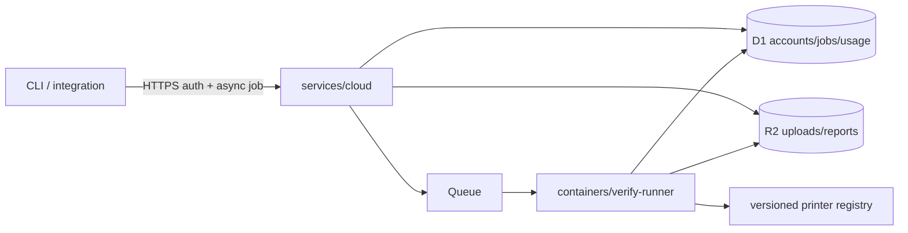

# Verification deployment architecture

This document describes the two supported execution modes after the 2026-09-05 amendment to
[ADR 0003](adr/0003-hosted-verification-service.md).

## 1. Embedded mode

`dry-wasm` and `@dry/sdk` run verification inside the browser or Node process. Inputs stay local and
the caller owns memory, availability and persistence. This mode is appropriate for interactive,
small-file and offline use; the Worker-isolate memory ceiling is not a hosted capacity tier.

## 2. Hosted asynchronous mode

The Worker is the sole public ingress. It performs identity, quota, persistence and job lifecycle
work; it does not import G-code or execute `dry-core`. The private native runner owns verification
semantics and streams input through disk-backed temporary storage.

The supported HTTP contract is `POST /v1/jobs/verify` plus `GET /v1/jobs/{id}`. The retired direct
proxy's synchronous `/verify` route is not part of the product.

## 3. Archived evidence

`crates/cloud` contains the original Workers-Rust measurement spike. It remains compile/test gated
and exposes only `POST /spike/verify` so the memory experiment stays reproducible. It is outside the
product topology and must not be listed as a serverless verification tier.

## 4. Capacity and correctness contracts

| Property | Embedded | Hosted async |
|---|---|---|
| Engine | wasm build of `dry-core` | native `dry-core` in verify-runner |
| Public persistence | none | D1 + R2 |
| Input ceiling | caller memory | 100 MB admission limit |
| Execution memory | caller runtime | Cloudflare `standard-3` container |
| Correctness evidence | wasm/native parity tests | runner/CLI byte-identical report tests |
| Availability claim | local only | not live until deployment proof is recorded |

The 100 MB contract and 43–50× import amplification rule out full verification in a 128 MB Worker
isolate. A clean report remains a static-rule result, not machine certification.
